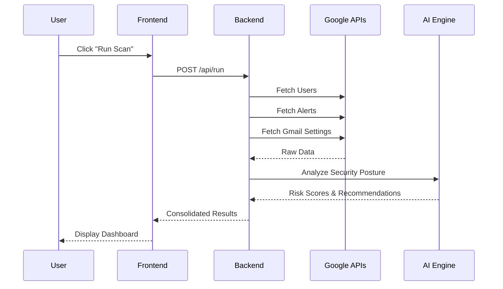

# AI-Enabled Email Security System Configuration Compliance Monitoring

> A comprehensive security dashboard for Google Workspace that leverages AI to monitor, analyze, and ensure compliance of email security configurations.

---

## 📋 Table of Contents

1. [Project Overview](#1-project-overview)
2. [Problem Statement](#2-problem-statement)
3. [Objectives](#3-objectives)
4. [Key Features](#4-key-features)
5. [System Architecture](#5-system-architecture)
6. [Technology Stack](#6-technology-stack)
7. [Module Breakdown](#7-module-breakdown)
8. [Data Flow](#8-data-flow)
9. [AI Integration](#9-ai-integration)
10. [Security Considerations](#10-security-considerations)
11. [Installation & Setup](#11-installation--setup)
12. [API Endpoints](#12-api-endpoints)
13. [Database Schema](#13-database-schema)
14. [Testing Strategy](#14-testing-strategy)
15. [Deployment](#15-deployment)
16. [Future Enhancements](#16-future-enhancements)

---

## 1. Project Overview

### 1.1 Introduction

The **AI-Enabled Email Security System Configuration Compliance Monitoring** is an advanced security dashboard designed for Google Workspace administrators. It provides real-time visibility into email security configurations, user access patterns, and compliance status across the organization.

### 1.2 Project Scope

| Aspect | Coverage |
|--------|----------|
| **Platform** | Google Workspace (Gmail, Admin SDK) |
| **Users** | IT Administrators, Security Officers, CISOs |
| **Deployment** | Self-hosted (Node.js server) |
| **AI Capability** | Risk analysis, recommendations, compliance monitoring |

### 1.3 Key Stakeholders

- **IT Security Team**: Primary users for daily monitoring
- **Compliance Officers**: Audit and policy enforcement
- **CISOs**: Executive dashboards and reports
- **System Administrators**: Configuration and maintenance

---

## 2. Problem Statement

### 2.1 Current Challenges

Organizations using Google Workspace face several security monitoring challenges:

1. **Fragmented Visibility**: Security settings are scattered across multiple Google Admin Console pages
2. **No AI-Powered Analysis**: Manual review of security configurations is time-consuming
3. **Compliance Gaps**: Difficult to ensure all users meet security policies
4. **Reactive Security**: Issues are discovered only after incidents occur
5. **No Centralized Reporting**: Executives lack consolidated security metrics

### 2.2 Impact

| Issue | Business Impact |
|-------|-----------------|
| Unsecured email forwarding | Data exfiltration risk |
| Disabled MFA | Account compromise vulnerability |
| Risky third-party apps | Unauthorized data access |
| Legacy protocols (POP/IMAP) | Credential theft vectors |
| Delayed threat detection | Prolonged exposure to attacks |

---

## 3. Objectives

### 3.1 Primary Objectives

1. **Centralized Monitoring**: Single dashboard for all email security configurations
2. **AI-Powered Risk Analysis**: Automatic identification and prioritization of security risks
3. **Compliance Enforcement**: Automated policy compliance checking and reporting
4. **Proactive Security**: Real-time alerts and AI recommendations
5. **Executive Reporting**: Automated security score and trend reports

### 3.2 Success Metrics

| Metric | Target |
|--------|--------|
| Security visibility coverage | 100% of GWS users |
| Time to identify risks | < 5 minutes (vs. hours manually) |
| Compliance check automation | 90% of policies automated |
| False positive rate | < 10% |
| User adoption | 80% active usage by security team |

---

## 4. Key Features

### 4.1 Core Features (Existing)

#### Identity & Access Management (IAM)
- User inventory with security attributes
- MFA enrollment status tracking
- Admin role assignments
- Login activity monitoring (success/failure)
- Password age tracking
- Suspended account detection

#### Email Security Monitoring
- Auto-forwarding rule detection
- External forwarding alerts
- POP3/IMAP/SMTP protocol status
- Domain-level SPF/DKIM/DMARC verification
- Mobile device access tracking

#### Third-Party App Access
- OAuth app inventory per user
- High-risk app identification
- App permission scope analysis
- Connected app trends

#### Alert Center Integration
- Real-time alert ingestion
- Alert categorization
- Affected user tracking
- Alert severity classification

### 4.2 AI-Powered Features (Planned)

#### AI Risk Scoring Engine
- Individual user risk scores (0-100)
- Organization-wide security posture score
- Risk factor breakdown and explanation
- Historical risk trend analysis

#### AI Compliance Monitor
- Policy definition and management
- Automated compliance checking
- Violation detection and alerting
- AI-generated remediation steps

#### AI Security Recommendations
- Personalized security recommendations
- Prioritized action items
- Natural language explanations
- One-click remediation links

#### AI Alert Analysis
- Intelligent alert correlation
- Incident summarization
- Threat pattern recognition
- Predictive threat intelligence

#### Natural Language Interface
- Chat-based security queries
- Conversational compliance checks
- Voice command support (future)

#### AI Report Generation
- Executive summary reports
- Trend analysis narratives
- Compliance audit reports
- Weekly/monthly automated reports

---

## 5. System Architecture

### 5.1 High-Level Architecture

```
┌─────────────────────────────────────────────────────────────────┐
│                        USER INTERFACE                           │
│  ┌─────────────┐  ┌─────────────┐  ┌─────────────────────────┐  │
│  │  Dashboard  │  │   Reports   │  │   AI Chat Interface     │  │
│  └─────────────┘  └─────────────┘  └─────────────────────────┘  │
└─────────────────────────────────────────────────────────────────┘
                              │
                              ▼
┌─────────────────────────────────────────────────────────────────┐
│                     APPLICATION LAYER                           │
│  ┌─────────────┐  ┌─────────────┐  ┌─────────────────────────┐  │
│  │   Express   │  │   Session   │  │   REST API Endpoints    │  │
│  │   Server    │  │   Manager   │  │   /api/*                │  │
│  └─────────────┘  └─────────────┘  └─────────────────────────┘  │
└─────────────────────────────────────────────────────────────────┘
                              │
                              ▼
┌─────────────────────────────────────────────────────────────────┐
│                      SERVICE LAYER                              │
│  ┌──────────────────┐  ┌──────────────────┐  ┌───────────────┐  │
│  │  Data Collection │  │  AI Analysis     │  │  Compliance   │  │
│  │  Service         │  │  Engine          │  │  Engine       │  │
│  └──────────────────┘  └──────────────────┘  └───────────────┘  │
└─────────────────────────────────────────────────────────────────┘
                              │
                              ▼
┌─────────────────────────────────────────────────────────────────┐
│                    EXTERNAL INTEGRATIONS                        │
│  ┌──────────────────┐  ┌──────────────────┐  ┌───────────────┐  │
│  │  Google Admin    │  │  Gmail API       │  │  AI API       │  │
│  │  SDK             │  │                  │  │  (Gemini)     │  │
│  └──────────────────┘  └──────────────────┘  └───────────────┘  │
│  ┌──────────────────┐  ┌──────────────────┐                     │
│  │  Alert Center    │  │  Reports API     │                     │
│  │  API             │  │                  │                     │
│  └──────────────────┘  └──────────────────┘                     │
└─────────────────────────────────────────────────────────────────┘
                              │
                              ▼
┌─────────────────────────────────────────────────────────────────┐
│                      DATA LAYER                                 │
│  ┌──────────────────┐  ┌──────────────────┐  ┌───────────────┐  │
│  │  config.json     │  │  Session Store   │  │  Cached Data  │  │
│  │  (encrypted)     │  │  (file-based)    │  │  (in-memory)  │  │
│  └──────────────────┘  └──────────────────┘  └───────────────┘  │
└─────────────────────────────────────────────────────────────────┘
```

### 5.2 Component Interaction



---

## 6. Technology Stack

### 6.1 Backend

| Component | Technology | Purpose |
|-----------|------------|---------|
| Runtime | Node.js 18+ | Server-side JavaScript |
| Framework | Express.js | Web application framework |
| Session | express-session + session-file-store | User session management |
| Authentication | JWT (Google Auth) | Service account authentication |
| Encryption | Node.js crypto (AES-256-CBC) | Config encryption |
| Logging | Pino | Structured logging |
| Scheduling | node-cron | Automated scans |

### 6.2 Frontend

| Component | Technology | Purpose |
|-----------|------------|---------|
| UI Framework | Vanilla HTML/JS | Dashboard interface |
| Styling | Tailwind CSS (CDN) | Responsive design |
| Charts | Chart.js | Data visualization |
| Tables | DataTables | Interactive data grids |
| PDF Export | jsPDF | Report generation |

### 6.3 External APIs

| API | Purpose |
|-----|---------|
| Google Admin SDK | User management, login reports |
| Gmail API | Email settings, forwarding rules |
| Alert Center API | Security alerts |
| Google Reports API | Login activity data |
| Gemini API (planned) | AI analysis and recommendations |

### 6.4 Development Tools

| Tool | Purpose |
|------|---------|
| nodemon | Development hot-reload |
| npm | Package management |
| dotenv | Environment configuration |

---

## 7. Module Breakdown

### 7.1 Authentication Module

**Purpose**: Secure access to the dashboard

| Function | Description |
|----------|-------------|
| `loadConfig()` | Load and decrypt service account credentials |
| `saveConfig()` | Encrypt and save configuration |
| `encrypt()` | AES-256-CBC encryption |
| `decrypt()` | AES-256-CBC decryption |
| `testCredentials()` | Validate service account access |
| `requireLogin` | Express middleware for page auth |
| `requireApiLogin` | Express middleware for API auth |

### 7.2 Data Collection Module

**Purpose**: Gather security data from Google Workspace

| Function | Description |
|----------|-------------|
| `listAllUsers()` | Fetch all domain users with attributes |
| `getAllAlerts()` | Fetch alerts from Alert Center |
| `listMobileDevices()` | Fetch mobile device inventory |
| `getLoginEventsForUser()` | Get login history per user |
| `getGmailSettingsForUser()` | Get email configuration per user |
| `getTokenInfoForUser()` | Get OAuth apps per user |
| `getAdminRolesForUsers()` | Get admin role assignments |
| `getDomainEmailSettings()` | Check SPF/DKIM/DMARC |
| `collectAll()` | Orchestrate full data collection |

### 7.3 Security Scoring Module (Current)

**Purpose**: Calculate security metrics

| Function | Description |
|----------|-------------|
| `calculateOverallSecurityScore()` | Weighted security score (0-100%) |
| `calculateIamScore()` | IAM-specific security score |
| `calculateEmailScore()` | Email security score |
| `calculateForwardingScore()` | Forwarding risk score |
| `calculateProtocolScore()` | Legacy protocol score |
| `calculateAppsScore()` | Third-party app risk score |

### 7.4 AI Analysis Module (Planned)

**Purpose**: AI-powered security analysis

| Function | Description |
|----------|-------------|
| `analyzeUserRisk()` | AI risk scoring per user |
| `generateRecommendations()` | AI security recommendations |
| `checkCompliance()` | AI compliance policy checking |
| `correlateAlerts()` | AI alert correlation |
| `summarizeIncident()` | AI incident summarization |
| `chatQuery()` | Natural language security queries |
| `generateReport()` | AI report generation |

### 7.5 Reporting Module

**Purpose**: Export and reporting

| Function | Description |
|----------|-------------|
| `downloadCSV()` | Export data as CSV |
| `downloadPDF()` | Export data as PDF |
| `scheduleReport()` | Automated scheduled reports |

### 7.6 Scheduling Module

**Purpose**: Automated operations

| Function | Description |
|----------|-------------|
| `setupCronJob()` | Configure scheduled scans |
| `runScheduledScan()` | Execute scheduled scan |

---

## 8. Data Flow

### 8.1 User Authentication Flow

```
┌──────────┐    ┌───────────────┐    ┌──────────────┐    ┌──────────┐
│  Login   │───▶│  Validate     │───▶│  Test Google │───▶│  Create  │
│  Page    │    │  Credentials  │    │  API Access  │    │  Session │
└──────────┘    └───────────────┘    └──────────────┘    └──────────┘
                                                               │
                                                               ▼
                                                         ┌──────────┐
                                                         │ Dashboard│
                                                         └──────────┘
```

### 8.2 Security Scan Flow

```
┌──────────┐    ┌───────────────┐    ┌──────────────┐    ┌──────────┐
│  Trigger │───▶│  Fetch Users  │───▶│  Fetch Email │───▶│  Fetch   │
│  Scan    │    │  from Admin   │    │  Settings    │    │  Alerts  │
└──────────┘    └───────────────┘    └──────────────┘    └──────────┘
                                                               │
                ┌──────────────────────────────────────────────┘
                ▼
┌──────────┐    ┌───────────────┐    ┌──────────────┐    ┌──────────┐
│ Enrich   │───▶│  Calculate    │───▶│  AI Analysis │───▶│  Cache & │
│ User Data│    │  Scores       │    │  (planned)   │    │  Display │
└──────────┘    └───────────────┘    └──────────────┘    └──────────┘
```

### 8.3 AI Analysis Flow (Planned)

```
┌──────────────┐    ┌─────────────────┐    ┌────────────────┐
│  Collected   │───▶│  Prepare AI     │───▶│  Send to       │
│  Security    │    │  Context/Prompt │    │  Gemini API    │
│  Data        │    │                 │    │                │
└──────────────┘    └─────────────────┘    └────────────────┘
                                                    │
                    ┌───────────────────────────────┘
                    ▼
┌──────────────┐    ┌─────────────────┐    ┌────────────────┐
│  Display     │◀───│  Parse AI       │◀───│  Receive AI    │
│  Results     │    │  Response       │    │  Response      │
└──────────────┘    └─────────────────┘    └────────────────┘
```

---

## 9. AI Integration

### 9.1 AI Architecture

```
┌─────────────────────────────────────────────────────────────┐
│                      AI ENGINE                              │
├─────────────────────────────────────────────────────────────┤
│  ┌─────────────────┐  ┌─────────────────┐  ┌─────────────┐  │
│  │  Risk Scoring   │  │  Recommendations│  │  Compliance │  │
│  │  Module         │  │  Module         │  │  Module     │  │
│  └────────┬────────┘  └────────┬────────┘  └──────┬──────┘  │
│           │                    │                  │         │
│           └────────────────────┼──────────────────┘         │
│                                ▼                            │
│                    ┌───────────────────┐                    │
│                    │   Gemini API      │                    │
│                    │   Interface       │                    │
│                    └───────────────────┘                    │
├─────────────────────────────────────────────────────────────┤
│  ┌─────────────────┐  ┌─────────────────┐  ┌─────────────┐  │
│  │  Chat Interface │  │  Report Writer  │  │  Alert      │  │
│  │  Module         │  │  Module         │  │  Analyzer   │  │
│  └─────────────────┘  └─────────────────┘  └─────────────┘  │
└─────────────────────────────────────────────────────────────┘
```

### 9.2 AI Use Cases

#### Use Case 1: User Risk Scoring

**Input**:
```json
{
  "user": "john@company.com",
  "mfaEnabled": false,
  "isAdmin": true,
  "externalForwarding": true,
  "highRiskApps": 3,
  "failedLogins": 15,
  "lastPasswordChange": "2023-01-15"
}
```

**AI Output**:
```json
{
  "riskScore": 85,
  "riskLevel": "CRITICAL",
  "factors": [
    { "factor": "No MFA on admin account", "weight": 30 },
    { "factor": "External email forwarding active", "weight": 25 },
    { "factor": "3 high-risk OAuth apps", "weight": 15 },
    { "factor": "High failed login attempts", "weight": 10 },
    { "factor": "Password older than 365 days", "weight": 5 }
  ],
  "recommendations": [
    "URGENT: Enable MFA immediately for this admin account",
    "Review and disable external forwarding rule",
    "Audit and revoke high-risk OAuth apps"
  ]
}
```

#### Use Case 2: Compliance Check

**Policy Definition**:
```json
{
  "policyName": "Admin Security Policy",
  "rules": [
    { "field": "mfaEnabled", "operator": "equals", "value": true },
    { "field": "externalForwarding", "operator": "equals", "value": false },
    { "field": "passwordAgeDays", "operator": "lessThan", "value": 90 }
  ],
  "appliesTo": "admins"
}
```

**AI Compliance Report**:
```
COMPLIANCE REPORT: Admin Security Policy
========================================
Overall Compliance: 67% (2 of 3 admins compliant)

VIOLATIONS:
- john@company.com: MFA not enabled, external forwarding active
- sarah@company.com: Password 120 days old (exceeds 90-day limit)

RECOMMENDATIONS:
1. Priority 1: Enable MFA for john@company.com (Security Risk: Critical)
2. Priority 2: Force password reset for sarah@company.com
3. Priority 3: Disable forwarding for john@company.com
```

#### Use Case 3: Natural Language Query

**User Query**: "Which admin users have risky configurations?"

**AI Response**:
```
I found 2 admin users with risky configurations:

1. **john@company.com** (Risk Score: 85 - CRITICAL)
   - MFA not enabled
   - External forwarding to personal@gmail.com
   - 3 high-risk apps connected

2. **sarah@company.com** (Risk Score: 45 - MEDIUM)
   - Password 120 days old
   - POP3 access enabled

Recommended Action: Focus on john@company.com first due to critical risk level.
```

### 9.3 AI Prompt Engineering

#### Risk Analysis Prompt Template:
```
You are a security analyst for Google Workspace. Analyze the following user's 
security configuration and provide a risk assessment.

USER DATA:
{userData}

ORGANIZATION CONTEXT:
- Industry: {industry}
- User Role: {role}
- Previous Incidents: {incidents}

Provide your analysis in the following JSON format:
{
  "riskScore": <0-100>,
  "riskLevel": "<LOW|MEDIUM|HIGH|CRITICAL>",
  "factors": [{"factor": "description", "weight": <points>}],
  "recommendations": ["action1", "action2"]
}
```

### 9.4 AI Configuration

```javascript
// AI Configuration (to be stored in config.json)
{
  "ai": {
    "enabled": true,
    "provider": "gemini",
    "apiKey": "<encrypted>",
    "model": "gemini-pro",
    "settings": {
      "temperature": 0.3,
      "maxTokens": 1024,
      "topP": 0.8
    },
    "features": {
      "riskScoring": true,
      "recommendations": true,
      "compliance": true,
      "chatInterface": true,
      "reportGeneration": true
    }
  }
}
```

---

## 10. Security Considerations

### 10.1 Authentication & Authorization

| Layer | Security Measure |
|-------|------------------|
| Service Account | OAuth 2.0 with JWT |
| Dashboard Access | Session-based authentication |
| API Endpoints | Middleware authentication checks |
| Session Storage | File-based with encryption |

### 10.2 Data Protection

| Data Type | Protection Method |
|-----------|-------------------|
| Service Account Key | AES-256-CBC encryption at rest |
| Session Data | File-based storage with TTL |
| API Responses | HTTPS only (in production) |
| Passwords | Never stored (OAuth flow) |

### 10.3 Access Control

| Role | Permissions |
|------|-------------|
| Admin | Full access to all features |
| Viewer (planned) | Read-only dashboard access |
| API Access | Requires valid session |

### 10.4 Security Best Practices

1. **Credential Management**
   - Store `APP_SECRET` in `.env` file
   - Never commit credentials to version control
   - Rotate service account keys regularly

2. **Session Security**
   - Sessions expire after 24 hours
   - Secure cookies in production
   - File-based storage for persistence

3. **API Security**
   - All API routes require authentication
   - JSON responses only (no HTML redirects)
   - Rate limiting (planned)

4. **Audit Logging**
   - All authentication attempts logged
   - API access logged with Pino
   - Security scans timestamped

---

## 11. Installation & Setup

### 11.1 Prerequisites

- Node.js 18+
- npm 9+
- Google Workspace Admin access
- GCP Project with enabled APIs

### 11.2 Required Google APIs

1. Admin SDK API
2. Gmail API
3. Alert Center API
4. Google Cloud Resource Manager API (for org policies)

### 11.3 Installation Steps

```bash
# 1. Clone repository
git clone https://github.com/SYEDIRFAANSJ/Google-Workspace-Security-Automation-Tool
cd Google-Workspace-Security-Automation-Tool

# 2. Install dependencies
npm install

# 3. Configure environment
cp .env.example .env
# Edit .env with your APP_SECRET

# 4. Run the application
npm run dev

# 5. Access dashboard
# Navigate to http://localhost:3000/login
```

### 11.4 Service Account Setup

1. Create service account in GCP Console
2. Grant domain-wide delegation
3. Add required OAuth scopes:
   - `https://www.googleapis.com/auth/admin.directory.user.readonly`
   - `https://www.googleapis.com/auth/admin.directory.device.mobile.readonly`
   - `https://www.googleapis.com/auth/admin.reports.audit.readonly`
   - `https://www.googleapis.com/auth/gmail.settings.basic`
   - `https://www.googleapis.com/auth/apps.alerts`

### 11.5 First-Time Configuration

1. Open login page
2. Enter admin email
3. Upload service account key JSON
4. System validates credentials
5. Configuration saved (encrypted)

---

## 12. API Endpoints

### 12.1 Authentication Endpoints

| Method | Endpoint | Description |
|--------|----------|-------------|
| GET | `/login` | Login page |
| POST | `/api/save-config` | Save credentials |
| GET | `/logout` | Destroy session |

### 12.2 Data Endpoints

| Method | Endpoint | Description |
|--------|----------|-------------|
| GET | `/api/run` | Trigger full security scan |
| GET | `/api/latest` | Get cached scan data |
| GET | `/api/config/view` | View current config (sanitized) |

### 12.3 Settings Endpoints

| Method | Endpoint | Description |
|--------|----------|-------------|
| GET | `/api/schedule` | Get scan schedule |
| POST | `/api/schedule` | Update scan schedule |

### 12.4 Planned AI Endpoints

| Method | Endpoint | Description |
|--------|----------|-------------|
| GET | `/api/ai/risk-scores` | Get AI risk scores |
| POST | `/api/ai/analyze` | Trigger AI analysis |
| POST | `/api/ai/chat` | Natural language query |
| GET | `/api/ai/compliance` | Get compliance status |
| POST | `/api/ai/report` | Generate AI report |

---

## 13. Database Schema

### 13.1 Current Storage (File-Based)

#### config.json
```json
{
  "adminUser": "admin@domain.com",
  "domain": "domain.com",
  "serviceAccountCreds": {
    "type": "service_account",
    "project_id": "project-id",
    "private_key_id": "...",
    "private_key": "<encrypted>",
    "client_email": "sa@project.iam.gserviceaccount.com",
    "client_id": "..."
  },
  "schedule": {
    "enabled": true,
    "time": "02:00"
  },
  "ai": {
    "enabled": false,
    "apiKey": "<encrypted>"
  }
}
```

#### Cached Data (In-Memory)
```json
{
  "ok": true,
  "ts": "2026-02-06T14:00:00Z",
  "currentUser": "admin@domain.com",
  "users": [...],
  "alerts": [...],
  "domainEmailSettings": [...],
  "totalAlertCount": 5
}
```

### 13.2 Planned Database (Optional BigQuery)

```sql
-- Users security snapshot
CREATE TABLE user_security_snapshots (
  snapshot_id STRING,
  timestamp TIMESTAMP,
  user_email STRING,
  mfa_enabled BOOLEAN,
  is_admin BOOLEAN,
  external_forwarding BOOLEAN,
  risk_score INTEGER,
  ai_recommendations ARRAY<STRING>
);

-- Compliance audit log
CREATE TABLE compliance_audits (
  audit_id STRING,
  timestamp TIMESTAMP,
  policy_name STRING,
  compliance_percentage FLOAT,
  violations ARRAY<STRUCT<user STRING, violation STRING>>
);
```

---

## 14. Testing Strategy

### 14.1 Manual Testing

| Test Case | Steps |
|-----------|-------|
| Login Flow | 1. Navigate to /login → 2. Enter credentials → 3. Verify redirect to dashboard |
| Security Scan | 1. Click "Run Full Check" → 2. Wait for completion → 3. Verify data display |
| Session Persistence | 1. Login → 2. Restart server → 3. Refresh page → 4. Verify still logged in |
| Export | 1. Run scan → 2. Click Download → 3. Verify CSV/PDF content |

### 14.2 API Testing

```bash
# Test scan endpoint (requires session)
curl -X GET http://localhost:3000/api/run \
  -H "Cookie: connect.sid=<session-id>"

# Expected: JSON with users, alerts, scores
```

### 14.3 Planned Automated Tests

- Unit tests for scoring functions
- Integration tests for Google API calls
- E2E tests for dashboard flows
- AI response validation tests

---

## 15. Deployment

### 15.1 Development

```bash
npm run dev  # Uses nodemon for hot-reload
```

### 15.2 Production

```bash
# Set environment
export NODE_ENV=production
export APP_SECRET=<long-random-string>

# Start server
node index.js
```

### 15.3 Docker (Planned)

```dockerfile
FROM node:18-alpine
WORKDIR /app
COPY package*.json ./
RUN npm ci --only=production
COPY . .
EXPOSE 3000
CMD ["node", "index.js"]
```

### 15.4 Cloud Deployment Options

| Platform | Method |
|----------|--------|
| Google Cloud Run | Docker container |
| GCP Compute Engine | VM with Node.js |
| Heroku | buildpack deployment |
| AWS EC2 | PM2 process manager |

---

## 16. Future Enhancements

### 16.1 Short-Term (Phase 1)

- [ ] AI risk scoring integration
- [ ] Natural language chat interface
- [ ] Enhanced compliance policies
- [ ] Email notifications for alerts

### 16.2 Medium-Term (Phase 2)

- [ ] Multi-tenant support
- [ ] Role-based access control
- [ ] BigQuery data warehouse
- [ ] Historical trend dashboards
- [ ] Slack/Teams integration

### 16.3 Long-Term (Phase 3)

- [ ] Automated remediation actions
- [ ] Threat intelligence feeds
- [ ] Custom AI model training
- [ ] Mobile application
- [ ] SSO integration

---

## 📊 Project Summary

| Metric | Value |
|--------|-------|
| **Lines of Code** | ~2,500 |
| **API Endpoints** | 7 (current) + 5 (planned) |
| **Google APIs** | 5 |
| **Frontend Pages** | 8 |
| **AI Modules** | 6 (planned) |
| **Security Checks** | 15+ |

---

## 📝 Document Information

| Field | Value |
|-------|-------|
| **Project Name** | AI-Enabled Email Security System Configuration Compliance Monitoring |
| **Version** | 1.0 |
| **Author** | Syed Irfaan |
| **Last Updated** | February 6, 2026 |
| **Status** | Core features implemented, AI integration planned |

---

*This document provides a comprehensive overview of the entire project. For implementation details, refer to the source code and inline documentation.*
